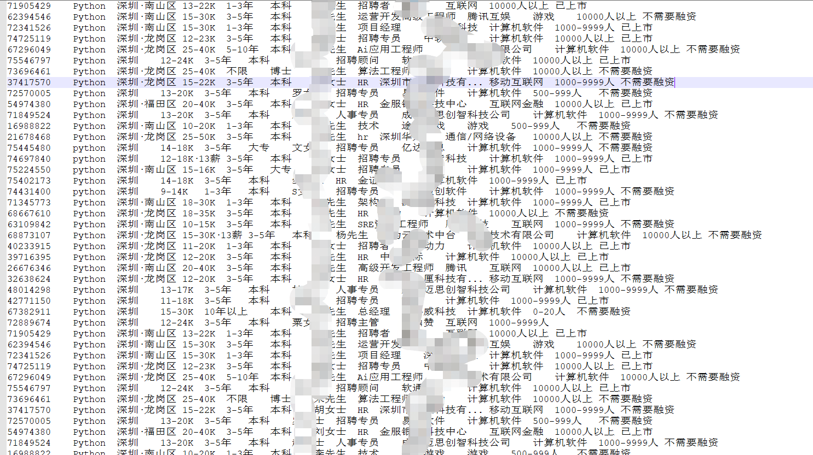

> 近日出于学习的目的对某Boss网站的反爬机制进行了分析和逆向，终于完全搞定了，记录总结下方便日后学习！
> 本代码请仅用于 **纯技术研究的** 用途，请勿用于商业用途或 非法用途，如果因使用者非法使用造成的法律问题与本作者无关！

# 涉及技术

> 核心js加密文件进行了全逆向，爬取方案不需要浏览器参与，纯 python+js 即可！

本爬取方案最终通过Python实现了完全自动化爬取职位信息列表页，并存储到一个txt文件中(需要的可自行扩展数据库实现)，为了简单起见未使用多线程，使用的技术有：

- python3
- requests 
- execjs 执行js脚本
- re 正则表达式
- BeautifulSoup 解析列表页面提取职位信息
- jsbeautify.js 为增加可读性，对加密js进行格式化处理

# 网站正常访问流程

1. 某Boss网站在访问页面时都需要携带一个 `__zp_stoken__`=xxxxxx 这样的cookie

2. 每次访问页面都会更新这个`__zp_stoken__`，（另外，每次`__zp_stoken__`其实可以使用数次（貌似<5次），具体次数没有试验）

   - 返回的页面会携带 `__zp_sseed__`、 `__zp_sname__`、`__zp_snts__` 三个cookie （通过查看response 的 set-cookie部分）
   - 基于这三个cookie值计算新的`__zp_stoken__`存入cookie中
   - 这个是三个cookie值消费完后会即刻删除，所以在浏览器中一般看不到这三个cookie值

3. 如果不携带cookie `__zp_stoken__`或者`__zp_stoken__`无效，就会返回一个302跳转

   - 302跳转Location 为  https://www.zhipin.com/web/common/security-check.html?seed=r9L%2BjsS5vloxpthkin%2F2Yskecz1G198Nk%2B4RCkA2YiA%3D&name=d05572cd&ts=1587092342543&callbackUrl=%2Fc101280600%2F%3Fquery%3Dpython%26page%3D2%26ka%3Dpage-2&srcReferer=

   - Location 中seed、name、ts为关键参数，用于计算 `__zp_stoken__`

   - 这个页面中的js所做的工作就是为

     - 按照name加载核心加密js文件
     - 设置cookie中的 `__zp_stoken__`
     - 精简后的核心js为

     ```javascript
                 var getQueryString = function(name) {
                     var reg = new RegExp("(^|&)" + name + "=([^&]*)(&|$)");
                     var r = window.location.search.substr(1).match(reg);
                     if (r != null) return unescape(r[2]);
                     return null;
                 };
     			
     			var seed = decodeURIComponent(getQueryString("seed")) || "";
                 var ts = getQueryString("ts");
                 var fileName = getQueryString("name");
     			
     			var expiredate = new Date().getTime() + 32 * 60 * 60 * 1000 * 2;
     			var code = "";
     			var ABC = window.ABC || frame.contentWindow.ABC;
     			try {
     				//code = new ABC().z(seed, parseInt(ts)+(480+new Date().getTimezoneOffset())*60*1000);
     				code = new ABC().z(seed, parseInt(ts));//+(480+new Date().getTimezoneOffset())*60*1000 时区相对于北京的偏移
     			} catch (e) {}
     			if (code ) Cookie.set("__zp_stoken__", code, expiredate, COOKIE_DOMAIN, "/"); //该方法会做一次 encodeURIComponent
     ```

> 对于2或3 拿到seed、name、ts后的流程基本一样，都是调用new ABC().prototype.z(seed,ts)函数，生成 `__zp_stoken__` 并做一次 encodeURIComponent 后存放到cookie中。

# 术语说明

- **seed** 是服务端发送的一个种子，由服务端控制生成
- **name** 是对应加密js的名字，这个name在每次访问时会动态变化，也及时获取的加密js不固定，由服务端控制生成，8位数字或字母的组合
- **ts** 是timestamp时间戳，由服务端控制生成
- **`__zp_stoken__`** 通过name指定的加密js 计算出来 cookie值，由客户端基于服务器提供seed和ts来生成，每次发送请求需携带有效的 **`__zp_stoken__`**
- **投毒** js代码中会对环境进行很多检测，如果识别为非正常浏览器，就会对某些参数进行修改，造成最终结果错误，成为投毒
- **解毒** 对代码中的投毒代码进行处理
- **zz** 加密js中的一个变量，对应最终生成的 `__zp_stoken__` ，是难得一见的具备可读性的变量
- **ABC** 加密js中的一个对象，也是生成最终 `__zp_stoken__` 的入口
- **常量池** 加密js中的第一行，就是定义了一个常量字符串数组（base64加密），其中存放的都是代码中用到字符串
- **常量池偏移** 常量池在进行字符串替换时，并不是直接按下标替换的，而是做了一个偏移（不同的js不一样）
- **运算符函数** 就是将一些简单的运算符转成了函数 如+-*/等等，原始js中存在大量的运算符函数
- **运算符函数替换** 对js中的运算符函数 替代成原始 操作符，并干掉运算符函数的过程就是运算符函数替换
- **switch扁平化** 原始js中很多switch case语句用来控制函数的执行流程，而判断的内容来源于某个数组，这个数组又是根据常量池中的某个常量按照|进行分割形成的，其实switch最终执行流程是固定，而按照这个数据对switch case进行函数顺序编排及替换就成为 switch扁平化

# 爬取方案流程

爬取方案的思路为

1. 访问页面获取302跳转的Location，提取seed name ts核心参数
2. 根据name请求对应加密js文件
3. 使用jsbeautify对加密js文件进行格式化
4. 对加密js进行运算法替换以及解毒处理
5. 调用js生成 `__zp_stoken__`
6. 通过 `__zp_stoken__` 爬取指定列表页数据
7. 解析页数，提取职位信息追加到result.txt中
8. 解析页面响应的头部信息，获取seed name ts
9. 根据seed name ts 再次 从第二步开始重复 

# 调用代码案例

```python
# 对指定的页面进行遍历翻页，将结果写入指定文件
provider={}
path="C:/boss/"  # 需要确保jsbeautify.js在该目录下，中间过程文件、最终文件都在该目录下
for i in range(10):
    url="https://www.zhipin.com/c101280600/?query=python&page="+str(i)+"&ka=page-"+str(i)
    text=bossSpider(url,provider)
    result=extractJobInfo(text)
    resultFileName=path+"result.txt"
    with open(resultFileName,'a',encoding='UTF-8') as f:
        f.write(result)
```

# 结果示例



# 解毒过程说明

> 以下说明过程都以temp.js为例，temp.js 是 对3d0a2109.js进行最简化处理后的核心代码

## debugger投毒处理

在调试时会频繁出现debugger断点，这是js中进行断点投毒，其中有定时任务频繁执行，无敌循环debugger，严重影响本地调试。

需要对temp.js 中全局变量 _0x1c69['0x3af'-0x0]的值进行替换  （全局变量名称会根据js的不同而不同）

只需要将js中的固定字符串 `YkZGNWFtTjJhWHhrWTFGU0lIQnJkR2NnZENBeUlHTjRiQ0E1ZEdsNFVWSXdJSGQ0ZFdwNmVuaG5NQ0JuZUdscVoyTWdZM2hzSURsMGFYaFJVaUJXSUhRZ015QmFXVmt3Y2xGU1VnPT0=` 

替换为`YkZGNWFtTjJhWHhrWTFGU0lIQnJkR2NnZENBeUlHTjRiQ0E1ZEdsNFVWSXdJQ0FnSUNBZ0lDQWdNQ0JuZUdscVoyTWdZM2hzSURsMGFYaFJVaUJXSUhRZ015QmFXVmt3Y2xGU1VnPT0=`

### 解释说明

常量池中原始字符串

```javascript
_0x1c69['0x3af'-0x0]="YkZGNWFtTjJhWHhrWTFGU0lIQnJkR2NnZENBeUlHTjRiQ0E1ZEdsNFVWSXdJQ0FnSUNBZ0lDQWdNQ0JuZUdscVoyTWdZM2hzSURsMGFYaFJVaUJXSUhRZ015QmFXVmt3Y2xGU1VnPT0=";
```

经过一次base64接码后

```javascript
_0x25ec['mdGvrp']['0x3af'-0x0]="bFF5amN2aXxkY1FSIHBrdGcgdCAyIGN4bCA5dGl4UVIwICAgICAgICAgMCBneGlqZ2MgY3hsIDl0aXhRUiBWIHQgMyBaWVkwclFSUg==";
```

这个比较特殊还需要再经过一次解密才能得到明文，也就是在调试时看到那个拼命无敌debugger

```javascript
(function() {var a = new Date(); debugger; return new Date() - a > 100;}()) 
```

为了优雅的搞掉他，我对解密函数进行了你想，写了加密函数encry，然后将明文中的debugger替换成空格，则给base64编码得到无毒的字符串常量用于替换

```javascript
btoa(btoa(encry("(function() {var a = new Date();         ; return new Date() - a > 100;}())")));//去掉debugger  注意要两次base64加密

//YkZGNWFtTjJhWHhrWTFGU0lIQnJkR2NnZENBeUlHTjRiQ0E1ZEdsNFVWSXdJQ0FnSUNBZ0lDQWdNQ0JuZUdscVoyTWdZM2hzSURsMGFYaFJVaUJXSUhRZ015QmFXVmt3Y2xGU1VnPT0=
```

本地调试时只需进行这一步替换就能解决到debugger问题了。

域名投毒处理

temp.js的 1572行，涉及域名投毒，本地调试或执行js时获取域名是不对的，而这个域名是需要参与最终cookie计算的，所以需要处理，处理方式比较暴力简单，强制写成正确的域名即可，把其余代码注释掉。

```javascript
case '4': _0x476e10 ="https://www.zhipin.com/";
            //_0x476e10 = ((typeof top) == ( _0x261f6f[_0x40b4('0x345')])) && ((typeof top[_0x40b4('0x199')]) == ( _0x261f6f[_0x40b4('0x345')])) && ((/\w+:\/\/(.*?)\//[_0x40b4('0x37c')](top[_0x40b4('0x199')][_0x40b4('0x8b')])) != ( null)) ? /\w+:\/\/(.*?)\//[_0x40b4('0x37c')](top[_0x40b4('0x199')][_0x40b4('0x8b')])[0x0] : _0x261f6f[_0x40b4('0x3ab')];
```


##  typeof 类的投毒处理（按调用顺序处理）

在js中会对系统环境进行多种判断，如果识别为非正常浏览就会投毒！

这些判断包括windows、document、global、title、setInterval等，为了可读性我进行了操作符函数替换后再做的如下处理（其实可以不用进行函数替换的），主要投毒位置记录如下，具体代码处理时的策略和下方标注略有差异。

### 74行

74行判断条件需要保证为true 或者 干掉投毒函数setInterval_ =false,ss 第9位置1

> 注释79-84行

```javascript
        Date[ptt][gm] = function() { //投毒 
修改Data.prototype.getMonth()函数固定返回12
            return ((((0x1) << ( 0x3))) | ( 0x4));
        }
        ;
        setInterval_ = ![];
        ss = ((ss) | ( ((0x1) << ( 0x8))));
```

以上代码全部注释掉

### 214 行

214行判断global process 等对象，不存在则投毒 ss 0xc+1置1

> 注释215行

原始代码

```javascript
if (((typeof global) != ( _0x2629ad[_0x2b8b('0x173')])) || ((typeof process) != ( _0x2629ad[_0x2b8b('0x173')])) || ((typeof child_process) != ( _0x2629ad[_0x2b8b('0x173')])) || ((typeof Buffer) != ( _0x2629ad[_0x2b8b('0x173')])) || ((typeof sessionStorage) == ( _0x2629ad[_0x2b8b('0x173')]))) {//干掉或注释下面的内容
        ss = ((ss) | ( ((0x1) << ( 0xc))));
    }
```

解析后

```javascript
    if (((typeof global) != ( _0x2629ad[_0x2b8b('0x173')])) || ((typeof process) != ( _0x2629ad[_0x2b8b('0x173')])) || ((typeof child_process) != ( _0x2629ad[_0x2b8b('0x173')])) || ((typeof Buffer) != ( _0x2629ad[_0x2b8b('0x173')])) || ((typeof sessionStorage) == ( _0x2629ad[_0x2b8b('0x173')]))) {
        ss = ((ss) | ( ((0x1) << ( 0xc))));
    }
```

### 284-287行

>284-287注释掉  ss = ss | 31;//1-5位置1

1. 284行判断浏览器类型 确保执行 ss = ss | (0x1 << 0x1) 倒数第2位置1,否则0xf+1位投毒置1

   原始代码

   ```javascript
   ((typeof window) == ( _0x2c63cc[_0x2b8b('0x395')])) && ((typeof window[_0x2b8b('0xf4')]) == ( _0x2c63cc[_0x2b8b('0x395')])) ? ((typeof window[_0x2b8b('0xf4')][_0x2b8b('0xac')]) == ( _0x2c63cc[_0x2b8b('0x11c')])) ? /phantomjs/[_0x2b8b('0x32d')](window[_0x2b8b('0xf4')][_0x2b8b('0xac')][_0x2b8b('0x407')]()) ? ss = ((ss) | ( ((0x1) << ( 0xf)))) : window[_0x2b8b('0xf4')][_0x2b8b('0x1a8')] ? ss = ((ss) | ( ((0x1) << ( 0xf)))) : ss = ((ss) | ( ((0x1) << ( 0x1)))) : ((typeof window[_0x2b8b('0xf4')][_0x2b8b('0x8')]) == ( _0x2c63cc[_0x2b8b('0x116')])) ? ss = ((ss) | ( ((0x1) << ( 0xf)))) : !window[_0x2b8b('0xf4')][_0x2b8b('0x8')] ? ss = ((ss) | ( ((0x1) << ( 0xf)))) : ss = ((ss) | ( ((0x1) << ( 0xf)))) : ss = ((ss) | ( ((0x1) << ( 0xf))));
   ```

   解析后代码

   ```javascript
   ((typeof window) == ( "object")) && ((typeof window["navigator"]) == ( "object")) ? 
   	 ((typeof window["navigator"]["userAgent"]) == ( "string")) ? 
   		 /phantomjs/["test"](window["navigator"]["userAgent"]["toLowerCase"]()) ? 
   			ss = ((ss) | ( ((0x1) << ( 0xf)))) 
   			: window["navigator"]["webdriver"] ? ss = ((ss) | ( ((0x1) << ( 0xf)))) : ss = ((ss) | ( ((0x1) << ( 0x1)))) 
   		:((typeof window["navigator"]["appVersion"]) == ( "undefined")) ? 
   			ss = ((ss) | ( ((0x1) << ( 0xf)))) 
   			: !window["navigator"]["appVersion"] ? ss = ((ss) | ( ((0x1) << ( 0xf)))) : ss = ((ss) | ( ((0x1) << ( 0xf)))) 
   	: ss = ((ss) | ( ((0x1) << ( 0xf))));
   ```

2. 285行判断屏幕 确保执行 ss = ((ss) | ( ((0x1) << ( 0x2)))) 第3位置1,否则0x10+1位投毒置1

   原始代码

   ```javascript
   ((typeof window) == ( _0x2c63cc[_0x2b8b('0x395')])) && ((typeof window[_0x2b8b('0x30c')]) == ( _0x2c63cc[_0x2b8b('0x395')])) ? ((((window[_0x2b8b('0x30c')][_0x2b8b('0x426')]) + ( window[_0x2b8b('0x30c')][_0x2b8b('0x124')]))) > ( 0x0)) ? ss = ((ss) | ( ((0x1) << ( 0x2)))) : ss = ((ss) | ( ((0x1) << ( 0x10)))) : ss = ((ss) | ( ((0x1) << ( 0x10))));
   ```

   解析后代码

   ```javascript
   ((typeof window) == ( "object")) && ((typeof window["screen"]) == ( "object")) ? 
   		((((window["screen"]["availHeight"]) + ( window["screen"]["availWidth"]))) > ( 0x0)) ?
   			ss = ((ss) | ( ((0x1) << ( 0x2)))) 
   			: ss = ((ss) | ( ((0x1) << ( 0x10))))
   		: ss = ((ss) | ( ((0x1) << ( 0x10))));
   ```

3. 286行判断getElementById 确保执行 ss = ((ss) | ( ((0x1) << ( 0x3)))) 第4位置1,否则0x11+1位投毒置1

   原始代码

   ```javascript
   ((typeof document) == ( _0x2c63cc[_0x2b8b('0x395')])) && ((typeof document[_0x2b8b('0x3dd')]) == ( fff)) ? !document[_0x2b8b('0x3dd')](_0x2c63cc[_0x2b8b('0x367')]) ? ss = ((ss) | ( ((0x1) << ( 0x3)))) : ss = ((ss) | ( ((0x1) << ( 0x11)))) : ss = ((ss) | ( ((0x1) << ( 0x11))));
   ```

   解析后代码

   ```javascript
   ((typeof document) == ( "object")) && ((typeof document["getElementById"]) == ( fff)) ? 
   		!document["getElementById"]("glcanvaxs") ? 
   			ss = ((ss) | ( ((0x1) << ( 0x3)))) 
   			: ss = ((ss) | ( ((0x1) << ( 0x11))))
   		: ss = ((ss) | ( ((0x1) << ( 0x11))));
   ```

4. 287行判断phantom 确保执行ss = ((ss) | ( ((0x1) << ( 0x4)))) 第5位置1,否则0x12+1位投毒置1

   原始代码

   ```javascript
    ((typeof window) == ( _0x2c63cc[_0x2b8b('0x395')])) ? ((typeof window[_0x2b8b('0x55')]) == ( _0x2c63cc[_0x2b8b('0x116')])) ? ss = ((ss) | ( ((0x1) << ( 0x4)))) : ss = ((ss) | ( ((0x1) << ( 0x12)))) : ((typeof window) == ( _0x2c63cc[_0x2b8b('0x395')])) && ((typeof window[_0x2b8b('0x34b')]) == ( _0x2c63cc[_0x2b8b('0x116')])) ? ss = ((ss) | ( ((0x1) << ( 0x12)))) : ss = ((ss) | ( ((0x1) << ( 0x12))));
   ```

   解析后代码

   ```javascript
   ((typeof window) == ( "object")) ? 
   		((typeof window["callPhantom"]) == ( "undefined")) ? 
   			ss = ((ss) | ( ((0x1) << ( 0x4)))) 
   			: ss = ((ss) | ( ((0x1) << ( 0x12)))) 
   		: ((typeof window) == ( "object")) && ((typeof window["_phantom"]) == ( "undefined")) ? 
   			ss = ((ss) | ( ((0x1) << ( 0x12)))) 
   			: ss = ((ss) | ( ((0x1) << ( 0x12))));
   ```

### 206 行

7. 判断window对象 是this  确保执行ss = ((ss) | ( 0x1)) 第1位置1,否则0xb+1位投毒置1，并debugger随机生成字符串
   注意这段代码在定时器中，会定时触发执行

> 206 207注释掉，前面插入 ss = ss|0x1;

原始代码

```javascript
        ((typeof window) != ( _0x1e3f0e[_0x2b8b('0x241')])) && ((this) == ( window)) ? ss = ((ss) | ( 0x1)) : (ss = ((ss) | ( ((0x1) << ( 0xb)))),
        _0x327c14 = _0x2ce1dc());
```

解析后代码

```javascript
((typeof window) != "undefined") && ((this) == ( window)) ?
	ss = ((ss) | ( 0x1)) 
	: (ss = ((ss) | ( ((0x1) << ( 0xb)))),_0x327c14 = _0x2ce1dc());
```

### 297-300 275行

297 298 300 275行代码判断横屏竖屏及调试 outer-inner如果<=160 为false ，否则为true window不存在也是true 好像没啥影响
定时触发

#### 297-300行

> 为避免麻烦，两个都确保为true，进入300行if判断的else分支  var _0x5c72b8 =true;//
> var _0x6c7431 =true;//

if分支会将ss的0x13+1位置1  100010000000000000011111

```javascript
var _0x5c72b8 = ((typeof window) == ( _0x5ecff7[_0x2b8b('0x1e9')])) ? ((((window[_0x2b8b('0x392')]) - ( window[_0x2b8b('0x1cb')]))) > ( _0x59c9ca)) : ![];
var _0x6c7431 = ((typeof window) == ( _0x5ecff7[_0x2b8b('0x1e9')])) ? ((((window[_0x2b8b('0x306')]) - ( window[_0x2b8b('0x19e')]))) > ( _0x59c9ca)) : ![];
var _0x4f3ce8 = _0x5c72b8 ? _0x5ecff7[_0x2b8b('0x21f')] : _0x5ecff7[_0x2b8b('0x21d')]; //width差值大于160为vertical，否则horizontal
if (!((_0x6c7431) && ( _0x5c72b8)) && (((typeof window) == ( _0x5ecff7[_0x2b8b('0x1e9')])) && ((typeof window[_0x2b8b('0x157')]) == ( _0x5ecff7[_0x2b8b('0x1e9')])) && ((typeof window[_0x2b8b('0x157')][_0x2b8b('0x2c8')]) == ( _0x5ecff7[_0x2b8b('0x1e9')])) && window[_0x2b8b('0x157')][_0x2b8b('0x2c8')][_0x2b8b('0x1dd')] || _0x5c72b8 || _0x6c7431))    
```

解析后为

```javascript
var _0x5c72b8 = ((typeof window) == ( "object")) ? ((((window["outerWidth"]) - ( window['innerWidth'))) > ( _0x59c9ca)) : ![];
var _0x6c7431 = ((typeof window) == ( "object")) ? ((((window["outerHeight"]) - ( window['innerHeight']))) > ( _0x59c9ca)) : ![];  if (! var _0x4f3ce8 = _0x5c72b8 ? _0x5ecff7[_0x2b8b('0x21f')] : _0x5ecff7[_0x2b8b('0x21d')]; //width差值大于160为vertical，否则horizontal
if (!((_0x6c7431) && ( _0x5c72b8))
	&& (((typeof window) == ("object")) 
		&& ((typeof window["Firebug"]) == ("object")) 
		&& ((typeof window["Firebug"]["chrome"]) == ("object")) 
		&& window["Firebug"]["chrome"]["isInitialized"] || _0x5c72b8 || _0x6c7431))
```

#### 275行

如果是调试状态会调用事件发布，执行275处的相关window判断, 确保**不**执行 0x1) << ( 0xd)

```javascript
((typeof window) != ( _0x5b9200[_0x2b8b('0x361')])) && ((typeof window[_0x2b8b('0x327')]) == ( fff)) && ((typeof CustomEvent) == ( fff)) ? window[_0x2b8b('0x327')](new CustomEvent(_0x5b9200[_0x2b8b('0xe0')],_0x4fa1b3)) : ss = ((ss) | ( ((0x1) << ( 0xd))));
```

解析后

```javascript
((typeof window) != "undefined") && ((typeof window["dispatchEvent"]) == ("function")) && ((typeof CustomEvent) == ( "function")) ?
	window["dispatchEvent"](new CustomEvent("bcr_change",_0x4fa1b3)) 
	: ss = ((ss) | ( ((0x1) << ( 0xd))));
```

### 调用new ABC().z()方法触发的投毒

接下来的方法都是调用main()之后触发

#### 349行

349行 给ts,seed赋值  确保三元运算符为false，或者截取: 前的代码

> (_0x327c14 = _0x33b55a,_0x46dced = _0x3220f9); 其他注释掉

```javascript
((typeof document) == ( _0x15044d[_0x2b8b('0x1f5')])) && ((typeof document[_0x2b8b('0x1b3')]) != ( _0x15044d[_0x2b8b('0x1fc')])) ? _0x327c14 = _0x2ce1dc() : (_0x327c14 = _0x33b55a,
            _0x46dced = _0x3220f9);
```

解析后为

```javascript
((typeof document) == "object") && ((typeof document["title"]) != ( "string")) ?
	_0x327c14 = _0x2ce1dc() : //生成一个随机字符串，44位，最后一位为=，下毒
	(_0x327c14 = _0x33b55a, _0x46dced = _0x3220f9);//第一个赋值seed，第二个赋值ts
```

#### 1739行

1739行 判断moveBy 确保执行((ss) | ( ((0x1) << ( 0x5)))) 第6位置1,否则0x14+1位投毒置1，并debugger随机生成字符串

> ss = ((ss) | ( ((0x1) << ( 0x5)))); 其余注释掉

```javascript
((typeof window) == ( _0x578d43[_0x2b8b('0x3f3')])) && /function|object/[_0x2b8b('0x32d')](typeof window[_0x2b8b('0x152')]) ? ss = ((ss) | ( ((0x1) << ( 0x5)))) : (ss = ((ss) | ( ((0x1) << ( 0x14)))),
            _0x327c14 = _0x2ce1dc());
```

解析后为

```javascript
((typeof window) == "object") && /function|object/["test"](typeof window["moveBy"]) ? 
	ss = ((ss) | ( ((0x1) << ( 0x5)))) 
	: (ss = ((ss) | ( ((0x1) << ( 0x14)))),_0x327c14 = _0x2ce1dc());
```

#### 1407行

1407行 判断window.open是函数 确保执行 ss| (0x1<< 0x6) 第7位置1，否则0x15+1投毒置1，并将seed置为随机字符串

> ss=ss| (0x1<< 0x6); 其余注释掉 两行
> 下面的特殊字符影响markdown显示  xxxx 删掉即可

```javascript
!!(((typeof window) == ( _0x578d43[_0x2b8b('0x3f3')])) && (((window[_0x2b8b('0x412')]) + ( ''))[_0x2b8b('0x70')]()[_0x2b8b('0x386')](/function\s*([^(]*)\xxxx(/)!=null)) ? ss = ((ss) | ( ((0x1) << ( 0x6)))) : (_0x327c14 = _0x2ce1dc(),
            ss = ((ss) | ( ((0x1) << ( 0x15)))));
```

解析后为

```javascript
!!((typeof window == "object") && ((window["open"]+ '')["toString"]()["match"](/function\s*([^(]*)\xxxx(/)!=null)) ? 
	ss = (ss| ( (0x1<< 0x6)))
	: (_0x327c14 = _0x2ce1dc(),ss = (ss| ( 0x1 << 0x15)));
```

#### 1699行

1699行 判断document.createElement可用 确保执行ss = ((ss) | ( ((0x1) << ( 0x7)))) 第8位置1，否则0x17投毒置1

> ss = ((ss) | ( ((0x1) << ( 0x7)))) ; 注释掉其余的

```javascript
((typeof document) == ( _0x578d43[_0x2b8b('0x3f3')])) && ((typeof document[_0x2b8b('0x391')]) == ( fff)) && ((typeof (caption = document[_0x2b8b('0x391')](_0x578d43[_0x2b8b('0x2e8')]))) == ( _0x578d43[_0x2b8b('0x3f3')])) && ((caption[_0x2b8b('0x24f')]) == ( _0x578d43[_0x2b8b('0x302')])) ? ss = ((ss) | ( ((0x1) << ( 0x7)))) : ss = ((ss) | ( ((0x1) << ( 0x16))));
            
```

解析后为

```javascript
((typeof document) == ("object")) && ((typeof document["createElement"]) == ( fff)) && ((typeof (caption = document["createElement"]("caption"))) == ( "object")) && ((caption["tagName"]) == ( "CAPTION")) ? 
	ss = ((ss) | ( ((0x1) << ( 0x7)))) 
	: ss = ((ss) | ( ((0x1) << ( 0x16))));
```

#### 1543行

1543行 判断window["moveTo"] 确保执行 ss = ((ss) | ( ((0x1) << ( 0x0))))，第0位置1，否则投毒0xe+1置1

> ss = ((ss) | ( ((0x1) << ( 0x0))))

```javascript
            !!(((typeof window) == ( _0x578d43[_0x2b8b('0x3f3')])) && window[_0x2b8b('0x137')]) ? ss = ((ss) | ( ((0x1) << ( 0x0)))) : (_0x327c14 = _0x2ce1dc(),
            ss = ((ss) | ( ((0x1) << ( 0xe)))));
```

解析后为

```javascript
!!(((typeof window) == "object") && window["moveTo"]) ? 
				ss = ((ss) | ( ((0x1) << ( 0x0)))) 
				: (_0x327c14 = _0x2ce1dc(), ss = ((ss) | ( ((0x1) << ( 0xe)))));
```

#### 88行

88行判断setInterval需要处理,否则官方定义会投毒 Date.getMonth

> 强制进入if分支，定义setIntervalnew为空函数

```javascript
if(true){//if (typeof setInterval == _0x2b8b('0x2ed') && setInterval[_0x2b8b('0x70')]()[_0x2b8b('0x1db')](/\s+/g, '') == _0x2b8b('0x2d3') || typeof setInterval == _0x2b8b('0x28')) {//setInterval未被替换
    setIntervalnew=function(a,b){};//setIntervalnew = setInterval;
}
```

#### 20行

第20行有一处 window 不用处理
处理`windows.atob()`函数，如果系统不存在该函数 官方代码自定义了算法，所以无需处理

到这里投毒类就都处理完成了

## js核心流程说明

通过逆向，发现js的核心流程就是一个AES加密算法。

加密模式ECB，填充方式pkcs5padding，数据块128位，密码4e227197bf508bab，偏移量4e227197bf508bab，输出base64，字符集gb2312

### 代码核心流程

No. 1.1 将 zz5IntArray_0x4c34d0 的前17位赋值，初始化后对应字符串 '4e227197bf508bab' 第17位对应整数0，对应原始代码5890行左右，关键字[0xf],下断点，即可得到秘钥

1. 生成要加密的原文

   No. 1.2 plainText_0x5bd912 为seed+'@'+"https://www.zhipin.com/@1587351053@8388833"+'@9a04'转成的整型数组追加 4个4 和 1个0 凑够97位
   "hQGTnOz8GDIwnLC+cm6m7eUC65EOVoF3GtqnngpvfN8="+'@'+"https://www.zhipin.com/@1587351053@8388833"+'@9a04'

2. 生成每次轮函数要是用的轮密钥

   No. 1.3 调用函数根据 zz5IntArray_0x4c34d0 生成复杂对象 complex2Array_0x1a6b6f 包含二维数组
   complex2Array_0x1a6b6f 中a开头的属性为数组结构，i开头的元素为整数

3. 将明文分组为6组，每组128位，循环对每一组进行AES加密

   No. 1.4 循环调用函数生成 zz97IntArray_0x14daee, 值来源于plainText_0x5bd912每次取16个进行处理，循环6次，complex2Array_0x1a6b6f 也参与计算

   - 1.4.1 调用核心代码encrypted16Reel_0x5de6e9 加密
       - No. 1.4.1.1  首次轮秘钥加，每次计算4个元素组成一个32位数	
       - No. 1.4.1.2  轮函数 循环10次处理a2中的数组

4. 最后一轮的加密结果进行扩展生成128位密文整数数组

   No. 1.5 调用函数生成 zz5IntArray_0x4c34d0，值来源于 zz97IntArray_0x14daee 97位数组用于扩展生成128位zz整数数组  3变4

5. 将密文按照ASCII码转成字符，并增加四个字符的前缀，也就最终cookie前身（再做一次encodeURIComponent就是 `__zp_stoken__`了）

   No. 1.6 生成zz也就是token值  前四位固定，后面由zz5IntArray_0x4c34d0按照ASCII码转变而来

   前四位获取位置，原始代码约789行 关键词zz =   zz = _0x1ddb83[_0x2241('0x2d0')];;  756行_0x5c82f4[_0x2241('0x2d0')] = _0x2241('0xf');

### 扩展思路

其实完全可以通过 js 获取固定的秘钥 和 固定的四字符前缀（js不同 秘钥、前缀也不同），然后在Python中使用标准AES算法直接计算`__zp_stoken__`值。有兴趣的同学可去实现！

> 通过官方js解析出秘钥和前缀 秘钥关键词[0xf] 大部分是常量赋值，但有一部分是通过date计算，前缀关键词zz = 通过一次函数替换由常量池获取，注意常量池有偏移量
>
> 自己通过AES加密获取`__zp_stoken__`
> 明文 seed+'@'+"https://www.zhipin.com/@+ts/1000+@8388833"+@+四位前缀
> token=encodeURICompent(四位前缀+生成的密文)

### 几个变量说明

- _0x14daee 97位数组用于扩展生成128位zz整数数组  3变4
- complex2Array.a7  .a8 存放原始秘钥
- .a9 临时存放
- .a2 轮秘钥 a2[0]存放原始秘钥 4个拼成一个 
- .a3 逆序轮秘钥 a3[10]存放原始秘钥 4个拼成一个 

### 关于算法的几点疑问

> 在逆向中存在以下几点疑问，知道的同学还望不吝赐教，我感激不尽!

- 标准AES算法中在进行字节代换时使用的是一个S盒，通过8位二进制的高、低四位形成行、列坐标，然后在S盒中获取替代值，只有一个S盒而且S盒中的值都是小于<256的，但在temp.js中存在四个S盒，而且S盒中存放的是32位数（有正有负数），为什么会有四个S盒？

- 在标准AES算法中在进行列混淆时，是通过一个常量矩阵相乘进行混淆的，而在temp.js中没看到常量矩阵的影子或者它使用的是全1的常量矩阵，这与标准的AES算法也对应不上，不知道这个常量矩阵和上面的四个S盒做了何种融合？（因为最终的计算结果和标准AES加密一致）
- 根据加密的调用次数不同，最终生成的`__zp_stoken__`也不完全相同，但都可以使用
  - 经过观察第一次调用生成是唯一
  - 连着调用第二次另外生成一个`__zp_stoken__`值，后续调用基本都是这个 `__zp_stoken__`
  - 偶尔会出现第三个`__zp_stoken__`值
  - 这三种情况产生的`__zp_stoken__`都可以正常使用

# 相关代码文件说明

- analysis   分析的过程文件目录
  - test.html 进行本地调试使用的页面
  - temp.js 对3d0a2109.js进行最简化处理后的核心代码，进行了详细标注
  - 3d0a2109.js  经过chrome格式化后的原始js，以这个js为案例代码进行逆向分析处理，python涉及行数的都是以这个原始js为蓝本为基础的
  - temp-3d0a2109.js   temp-3d0a2109-v2.js  temp-3d0a2109-v3.js 逆向分析的中间过程文件
- jsbeautify.js          python运行时需要调用的js，用于js代码格式化
- XBossSpider.py    最终python代码
- xxxxxxxx.js   运行时抓取的原始js文件
- xxxxxxxx-step1.js    对原始js进行格式化处理后的js
-  xxxxxxxx-step2.js   对原始js进行运算符函数替换后的js
- xxxxxxxx-step3.js    进行解毒处理后的js，也是最终python要执行的js文件
- result.txt 抓取后提取的职位信息，每行一个职位，每行职位的字段用 tab 分隔
